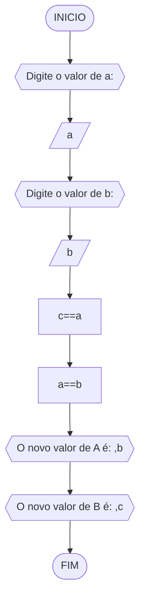
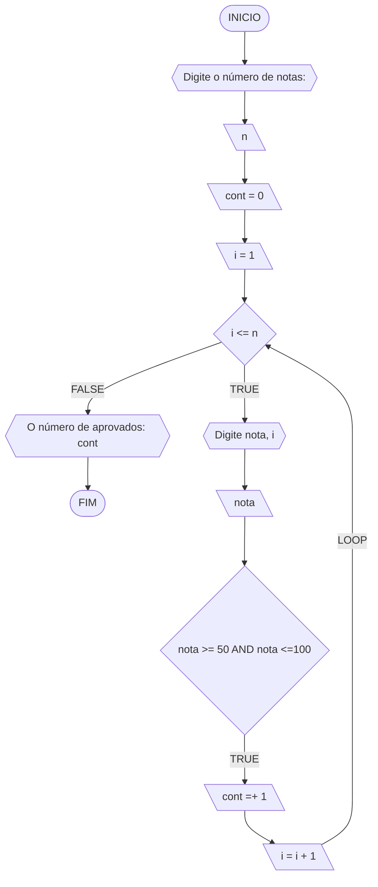
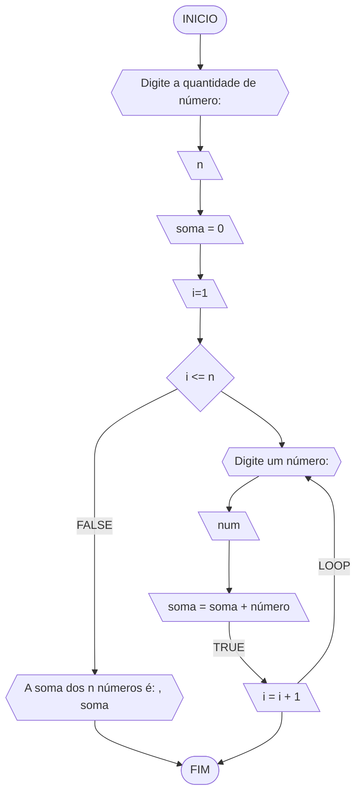
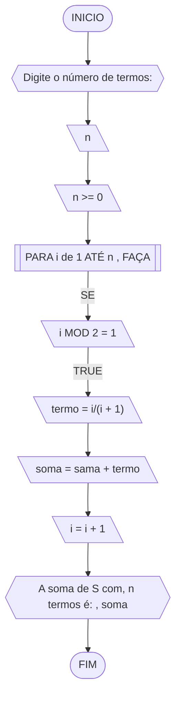
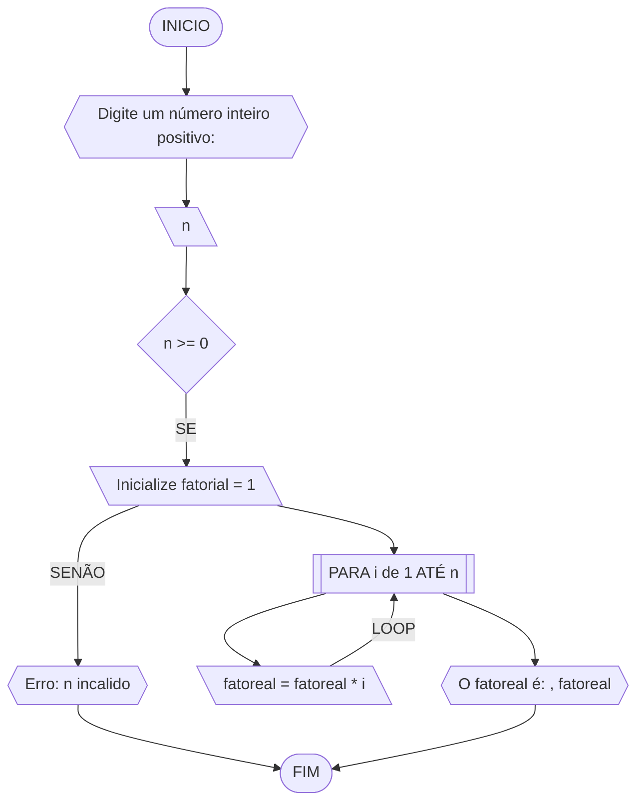
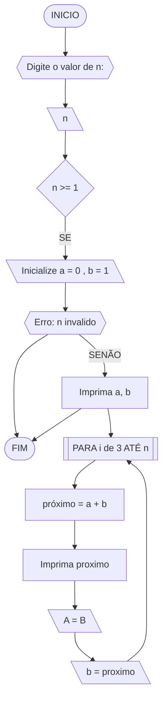
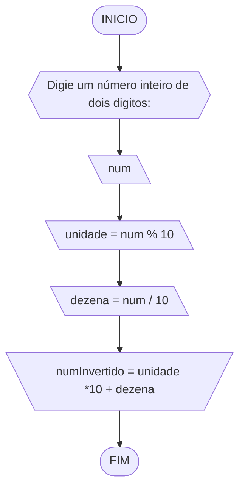

**Curso:** Engenharia Civil <br>
**Disciplina:** Raciocinio logico e algoritmo <br>
**Código/Turma:**  <br>
**Professor:** Ricardo Carubbi <br>
**Data:** 21/03/2024 <br>
**Aluno(a):** Sandra Diógenes <br>
**Matrícula:** 2219036 <br>

**1a chamada (Sim/Não):** Sim <br>
**2a chamada (Sim/Não):** Não

# Avaliação Diagnóstica 1

## Normas e exigências

Avaliação diagnóstica (**AD**) consiste em exercícios ou projetos desenvolvidos em grupo ao longo da disciplina. <br>
A primeira avaliação diagnóstica (**AD1**) será composta por exercícios e equivale a 30% da nota da primeira avaliação (**AV1**).

Segue abaixo a expressão para o cálculo da **AV1**, sendo sendo **AF1** equivale a primeira avaliação formativa e **AD1**, a primeira avaliação diagnóstica.

$$AV_1 = AF_1 \times 0,30 + AD_1 \times 0,70$$

A **AD1** é formada pela entrega dos exercícios (**EX1**) na data prevista e apresentação (**AP1**) de um dos exercícios escolhido pelo professor.
Segue abaixo a expressão para o cálculo da **AD1**.

$$AD_1 = EX1_1 + AP_1 $$

A **EX1** é avaliada mediante a **correção dos exercícios**, sendo a avaliação no intervalo de 0% (não atende a questão), 50% (atende parcialmente) e 100% (atende em sua totalidade).
Por exemplo, se o exercício equivale a 2 pontos e sua correção atente parcialmente a questão, então sua avaliação deste exercício será 1 ponto.

A **AP1** é avaliada mediante aos pré-requisitos de **clareza, organização e domínio do conteúdo**. Portanto, o aluno deve demonstrar um bom entendimento do algoritmo, explicando seus princípios fundamentais, seu propósito e como ele funciona passo a passo. <br>

A avaliação da **AP1** é apenas considerada no intervalo de 0% (não atende os pré-requisitos), 50% (atende parcialmente) e 100% (atende em sua totalidade).
Por exemplo, se na apresentação do exercício, o aluno atenter parcialmente os pré-requisitos, então sua avaliação da apresentação será 5,0.

## Lista de questões

### Questão 1 - Troca dos valores de duas variáveis (1 ponto)

Dadas duas variáveis, $a$ e $b$, implemente e teste um algoritmo para trocar os valores atribuídos a elas.
#### Fluxograma (0.25 ponto)



#### Pseudocódigo (0.5 ponto)

```
ALGORITMO TrocaValores
DECLARE a, b, c NÚMERO
ESCREVA "Digite o valor de a: "
LEIA a
ESCREVA "Digite o valor de b: "
LEIA b
c <- a
a <- b
b <- c
ESCREVA "VALORES TROCADO, " a = b, b = c
FIM_ALGORITMO
```

#### Teste de mesa (0.25 ponto)

| a  | b  | c=a | a=b | b=c  | saida      |
| -- | -- | --  | --  | --   | --         |
| 1  | 2  | 1   | 2   | 1    | a=2 e b=1  |  
|10  |30  |10   |30   |10    | a=30 e b=10|
|32  |43  |32   |43   |32    | a=43 e b=32|

### Questão 2 - Contagem (1 ponto)

Dado um conjunto $n$ de notas de alunos em um exame, implemente e teste um algoritmo para fazer uma contagem $cont$ do número de alunos que foram aprovados no exame. 
Será considerado aprovado o aluno que tirar $nota$ 50 ou maior (no intervalo de 0 a 100).

#### Fluxograma (0.25 ponto)


#### Pseudocódigo (0.5 ponto)

```
ALGORITMO Alunos_aprovados
DECLARE n, nota, cont: INTEIRO
INICIO
ESCREVA "Digite o número de alunos: "
LEIA n
cont<- 0
i = 1
ENQUANTO i <= n FAÇA
    ESCREVA "Digite a nota do aluno", i, ":"
    LEIA nota
    SE nota >= 50 AND nota <= 100 FAÇA
        cont = cont + 1
        FIM_SE
        i = i + 1
    FIM_ENQUANTO
    ESCREVA "Número de alunos aprovados: ", cont
FIM_ALGORITMO

```

#### Teste de mesa (0.25 ponto)

| aluno | nota | nota <= 50 and nota <= 100| resultado |  cont = +1|
| --    | --   |              --           |   --      |    --     |
|  1    | 40   |           FALSE           | reprovado |     0     |
|  2    |  70  |            TRUE           | aprovado  |     1     |
|  3    |  50  |            TRUE           | aprovado  |     2     |

### Questão 3 - Soma de um conjunto de números (1 ponto)

Dado um conjunto de $n$ números, implemente e teste um algoritmo para calcular a soma desses números. <br>
Aceite apenas $n$ maior ou igual a zero.

#### Fluxograma (0.25 ponto)



#### Pseudocódigo (0.5 ponto)

```
ALGORITMO Soma_Número
DECLARE n, número, i, soma: INTEIRO
INICIO
ESCREVA "Digite a quantidade de número: "
LEIA n
soma<- 0
PARA i de 1 até n FAÇA
    ESCREVA "Digite um número: "
    LEIA número
    soma <- soma + número
FIM_PARA
ESCREVA "A soma dos", n, números é: ", soma
FIM_ALGORITMO

```

#### Teste de mesa (0.25 ponto)

|  n  |  i | número |soma|
|  -- | -- |   --   | -- |
|  4  | 1  |   5    |  5 |
|  4  | 2  |  10    | 15 |
|  4  | 3  |  -2    | 13 |
|  4  | 4  |   7    | 20 |
|  4  | 5  |   -    |  - |

### Questão 4 - Cálculo de uma série (1 ponto)

Calcular o valor de S, conforme definido pela seguinte série infinita:

$$ S = \frac{1}{2} + \frac{3}{4} + \frac{5}{6} + \frac{7}{8} + \dots $$

#### Fluxograma (0.25 ponto)



#### Pseudocódigo (0.5 ponto)

```
ALGORITMO Calcular_Valor_S
DECLARE n, i: INTEIRO
DECLARE soma, termo: REAL
INICIO
ESCREVA "Digite número de termos: "
LEIA n
n <= 0
soma <- 0
PARA i de 1 até n, FAÇA
    SE i MOD 2 = 1 ENTÃO
        "termo <- i /(i + 1)"
        soma <- soma + termo
    FIM_SE
FIM_PARA
ESCREVA "O valor de S com", n, "termos é: ", soma
FIM_ALGORITMO
```

#### Teste de mesa (0.25 ponto)

| n = 5 | termo  |  soma  |  soma = soma + termo |resutado |         
|  --   |   --   |   --   |           --         |   --    |
|   -   |  1/2   |    0   |   soma = 0 + 1/2     |   1/2   |
|   -   |  3/4   |  1/2   |   soma = 1/2 + 3/4   |   5/4   |
|   -   |  5/6   |  5/4   |   soma = 5/4 + 5/6   |  25/12  |
|   -   |  7/8   | 25/12  | soma = 25/12 + 7/8   |  71/24  |
|   -   |  0/10  | 71/24  | soma = 71/24 + 9/10  | 763/120 |

### Questão 5 - Cálculo fatorial (2 pontos)

Dado um número $n$, calcular o fatorial de $n$ (escrito como $n!$), onde $n ≥ 0$
#### Fluxograma (0.5 ponto)



#### Pseudocódigo (1.0 ponto)

```
Algoritmo Calculo_Fatorial
DECLARE n, i, , fatorial: INTEIRO
ESCREVA "Digite um nùmero inteiro positivo: "
LEIA n
SE n <- >= 0
fatoreal <- 1
PARA i de 1 ATÉ n FAÇA
    fatoreal <- fatoreal * i
FIM_PARA
ESCREVA "O fatoreal de", n, é: ", fatoreal
FIM_ALGORITMO
```

#### Teste de mesa (0.5 ponto)

// fatoreal de 5! = 5 * 4 * 3 * 2 * 1 = 120 //


|n = 5|fatorial = 1| i = i * n | n! = n! * i | saida  |  
| --  |     --     |     --    |    --       |  --    |       
|  -  |     -      |           | n! = 1 * 1  |   1    |              
|  -  |     -      |           | n! = 1 * 2  |   2    |              
|  -  |     -      |           | n! = 2 * 3  |   6    |
|  -  |     -      |           | n! = 6 * 4  |   24   |
|  -  |     -      |           | n! = 24 * 5 |  120   | 


### Questão 6 - Geração da sequência de Fibonacci (2 pontos)

Gerar e imprimir os $n$ primeiros termos da sequência de Fibonacci, onde $n ≥ 1$. <br>
Os primeiros termos são: $0, 1, 1, 2, 3, 5, 8, 13, \dots$ <br>
Cada termo, além dos dois primeiros, é derivado da soma dos seus dois antecessores mais próximos.

#### Fluxograma (0.5 ponto)



#### Pseudocódigo (1.0 ponto)

```
ALGORITMO Srquencia_Fibonacci
DECLARE n, a, b, proximo: INTEIRO
ESCREVA "Digite o valor de n: "
LEIA n
n >= 1
a <- 0
b <- 1
ESCREVA "os primeiros" , n, "termos da sequência de Fibonacco sâo: "
LEIA n
PARA i de 3 até n FAÇA
    proximo <- a + b
    ESCREVA proximo, ", "
    a <- b
    b <- proximo
FIM_PARA
FIM_ALGORITIMO
FIM_ALGORITMO
```
#### Teste de mesa (0.5 ponto)

| It  |  n  |  termo | proximo |   saida    | 
|  -- | --  |   --   |    --   |     --     | 
|  1  |  8  |   0    |    -    |     0      |
|  2  |  8  |   1    |    -    |     1      |
|  3  |  8  |   -    |  0 + 1  |     1      |            
|  4  |  8  |   -    |  1 + 1  |     2      |            
|  5  |  8  |   -    |  1 + 2  |     3      |            
|  6  |  8  |   -    |  2 + 3  |     5      |
|  7  |  8  |   -    |  3 + 5  |     8      |
|  8  |  8  |   -    |  5 + 8  |    13      |


### Questão 7 - Inversão dos dígitos de um número inteiro (2 pontos)

Inverter a ordem dos dígitos de um número inteiro positivo.

#### Fluxograma (0.5 ponto)



#### Pseudocódigo (1.0 ponto)

```
Algoritmo Inverter_Digitos
DECLARE num, unidade, dezena, numInvertido: INTEIRO
ESCREVA "Digite um número inteiro positivo de dois digitos: "
LEIA num
unidade <- num % 10
dezena <- num / 10
numInvertido <- unidade * 10 + dezena
ESCREVA "Número invertido é: ", numInvertido
FIM_ALGORITMO
```

#### Teste de mesa (0.5 ponto)

| num |unidade = num % 10|dezena=num/10|calculo=unidade*10+dezena|numInvertido| 
| --  |        --        |     --      |              --         |     --     | 
| 37  |        7         |      3      |   calculo = 7 * 10 + 3  |     73     |
| 81  |        1         |      8      |   calculo = 1 * 10 + 8  |     18     |
| 25  |        5         |      2      |   calcule = 5 * 10 + 2  |     52     |
