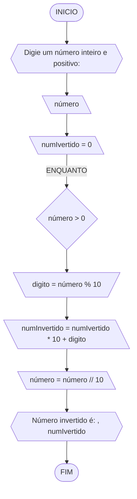

**Curso:** Engenharia Civil <br>
**Disciplina:** Raciocinio logico e algoritmo <br>
**Código/Turma:**  <br>
**Professor:** Ricardo Carubbi <br>
**Data:** 21/03/2024 <br>
**Aluno(a):** Sandra Diógenes <br>
**Matrícula:** 2219036 <br>

**1a chamada (Sim/Não):** Sim <br>
**2a chamada (Sim/Não):** Não

# Avaliação Diagnóstica 1

## Normas e exigências

Avaliação diagnóstica (**AD**) consiste em exercícios ou projetos desenvolvidos em grupo ao longo da disciplina. <br>
A primeira avaliação diagnóstica (**AD1**) será composta por exercícios e equivale a 30% da nota da primeira avaliação (**AV1**).

Segue abaixo a expressão para o cálculo da **AV1**, sendo sendo **AF1** equivale a primeira avaliação formativa e **AD1**, a primeira avaliação diagnóstica.

$$AV_1 = AF_1 \times 0,30 + AD_1 \times 0,70$$

A **AD1** é formada pela entrega dos exercícios (**EX1**) na data prevista e apresentação (**AP1**) de um dos exercícios escolhido pelo professor.
Segue abaixo a expressão para o cálculo da **AD1**.

$$AD_1 = EX1_1 + AP_1 $$

A **EX1** é avaliada mediante a **correção dos exercícios**, sendo a avaliação no intervalo de 0% (não atende a questão), 50% (atende parcialmente) e 100% (atende em sua totalidade).
Por exemplo, se o exercício equivale a 2 pontos e sua correção atente parcialmente a questão, então sua avaliação deste exercício será 1 ponto.

A **AP1** é avaliada mediante aos pré-requisitos de **clareza, organização e domínio do conteúdo**. Portanto, o aluno deve demonstrar um bom entendimento do algoritmo, explicando seus princípios fundamentais, seu propósito e como ele funciona passo a passo. <br>

A avaliação da **AP1** é apenas considerada no intervalo de 0% (não atende os pré-requisitos), 50% (atende parcialmente) e 100% (atende em sua totalidade).
Por exemplo, se na apresentação do exercício, o aluno atenter parcialmente os pré-requisitos, então sua avaliação da apresentação será 5,0.

## Lista de questões

### Questão 1 - Troca dos valores de duas variáveis (1 ponto)

Dadas duas variáveis, $a$ e $b$, implemente e teste um algoritmo para trocar os valores atribuídos a elas.

#### Descrição geral do algoritmo
1. Guardar o valor original da variável $a$ em uma variável auxiliar $aux$;
2. Atribuir à variável $a$ o valor original da variável $b$;
3. Atribuir à variável $b$ o valor original da variável $a$, que está armazenado na variável auxiliar $aux$.
4. Exibir os novos valores de $a$ e $b$.

#### Fluxograma (0.25 ponto)


#### Pseudocódigo (0.5 ponto)

```
ALGORITMO TrocaValores
DECLARE a, b, c: NÚMERO    // duvidas: quando coloco NÚMERO é admitindo INTEIRO e REAL?

INICIO
    // Insira a primeira instrução
    ESCREVA "Digite o valor de a: "
    // Guarda esta informação
    LEIA a
    // Insira a segunda instrução
    ESCREVA "Digite o valor de b: "
    // Guarda esta informação
    LEIA b
    // Atribui uma terceira variaval igual a 'a'
    c <- a
    // Atribui 'a' igual 'b'
    a <- b
    // Atribui 'b' igual 'c'
    b <- c
    // O novo valor de a 
    ESCREVA "a=", b        // duvida é pra troca de valores 'a fica b' e 'b fica a'
    // O novo valor de b 
    ESCREVA "b=", c       // duvida  c = a então b = c
FIM_ALGORITMO
```

#### Tabela de testes (0.25 ponto)

| a  | b  | c=a | a=b | b=c  | saida      |
| -- | -- | --  | --  | --   | --         |
| 1  | 2  | 1   | 2   | 1    | a=2 e b=1  |  
|10  |30  |10   |30   |10    | a=30 e b=10|
|32  |43  |32   |43   |32    | a=43 e b=32|

### Questão 2 - Contagem (1 ponto)

Dado um conjunto $n$ de notas de alunos em um exame, implemente e teste um algoritmo para fazer uma contagem $cont$ do número de alunos que foram aprovados no exame. 
Será considerado aprovado o aluno que tirar $nota$ 50 ou maior (no intervalo de 0 a 100).

#### Descrição geral do algoritmo
1. Obter o número de notas $n$ a serem processadas;
2. Inicializar a contagem $cont$ com zero;
3. Enquanto houver notas a serem processadas, fazer repetidamente:
    - obter a próxima nota;
    - se a nota for suficiente para passar no exame ($n ≥ 50$) então adicionar 1 (um) à contagem $cont$;
4. Exibir a contagem $cont$ (número total de aprovações).

#### Fluxograma (0.25 ponto)

Fluxograma conforme descrição do algoritmo acima, usando o loop ENQUANTO.


Fluxograma opcional usando o loop PARA.


#### Pseudocódigo (0.5 ponto)

```
ALGORITMO Conta_Aprovados
DECLARE n, nota, cont, i: INTEIRO

INICIO

    // Insira a primeira informação
    ESCREVA "Digite o número de alunos: " // duvida neste caso tanto faz pedi a quantidade de notas ou a número de alunos?
    // Guarda esta informação
    LEIA n
    // Iniciar contagem aparti do zero
    cont = 0
    // inclementar de 1 ate n "quantidade de notas"
    PARA i DE 1 ATÉ n FAÇA
        // Insira a nota do primeiro aluno
        ESCREVA "Digite a nota do aluno", i, ":"
        // Guarda esta informação
        LEIA nota
        // se a nota >=50 e nota <=100 Aprovado
        SE nota >= 50 E nota <= 100 ENTÃO
            // conte
            cont = cont + 1
        FIM_SE
    FIM_PARA
    // Transmita o resuldado
    ESCREVA "Número de alunos aprovados é:", cont

FIM

```

#### Tabela de testes (0.25 ponto)
Tabela de testes referente ao algoritmo usando o loop ENQUANTO.

| it | n  | i  | cont | i<=n  | nota, i | nota | nota_valida | cont+1 | i+1 | saída        | 
| -- | -- | -- | --   | --    | --      | --   | --          | --     | --  | --           |
| 1  | 5  | 1  |  0   | True  | nota 1  | 90   | True        | 1      | 2   |              |
| 2  | 5  | 2  |  1   | True  | nota 2  | 30   | False       | 1      | 3   |              |
| 3  | 5  | 3  |  1   | True  | nota 3  | 80   | True        | 2      | 4   |              |
| 4  | 5  | 4  |  2   | True  | nota 4  | 60   | True        | 3      | 5   |              |
| 5  | 5  | 5  |  3   | True  | nota 5  | 00   | False       | 3      | 6   |              |
| 6  | 5  | 6  |  3   | False |         |      |             |        |     | Aprovados: 3 |

Tabela de testes referente ao algoritmo usando o loop PARA.

| it | n  | cont |  i | nota, i | nota | nota_valida | cont+1 | saída      | 
| -- | -- | --   | -- |   --    | --   |     --      |   --   |      --    | 
| 1  | 5  |  0   |  1 |  nota 1 | 90   |    True     |    1   |            |          
| 2  | 5  |  1   |  2 |  nota 2 | 30   |    False    |    1   |            |
| 3  | 5  |  1   |  3 |  nota 3 | 80   |    True     |    2   |            |
| 4  | 5  |  2   |  4 |  nota 4 | 60   |    True     |    3   |            |
| 5  | 5  |  3   |  5 |  nota 5 | 00   |    False    |    3   |            |
| 6  | 5  |  3   |  6 |         |      |             |        |Aprovados: 3|   

### Questão 3 - Soma de um conjunto de números (1 ponto)

Dado um conjunto de $n$ números, implemente e teste um algoritmo para calcular a soma desses números. <br>
Aceite apenas $n$ maior ou igual a zero.

#### Descrição geral do algoritmo

1. Obter a quantidade de números $n$ a serem somados.
2. Inicializar a variável $soma$ com 0 (zero).
3. Enquanto menos do que $n$ números tiverem sido somados, fazer repetidamente:
    - obter o próximo número $i$;
    - calcular a soma atual, adicionando o número $i$ obtido à soma mais recente;
4. Exibir a soma dos $n$ números
   
#### Fluxograma (0.25 ponto)


#### Pseudocódigo (0.5 ponto)

```
ALGORITMO Soma_Número
DECLARE n, i, soma: INTEIRO

INICIO
    // Insira a primeira informação
    ESCREVA "Digite a quantidade de número: "
    // Guarda esta informação
    LEIA n
    // inseri condições satisfatoria
    SE n >=0 ENTAO
        // informar condições iniciais da soma
        soma <- 0
        // informar condições iniciais para o inclemento
        i <- 1
        // estabelecer informações condições
        ENQUANTO i <= n FAÇA
            // Insira a primeira informação
            ESCREVA "Digite um número:"
            // Guarda esta informação
            LEIA num
            // inserir operação matematica que soma todos os numeros 
            soma <- soma + num
            // inserir operação matematica para satifazer o inclemento
            i <- i + 1
        FIM_ENQUANTO

    //Condição de não satisfazer 
    SENÃO
    //Informar resultado
        ESCREVA "O valor deve ser maior ou igual a zero!"
    FIM_SE

    //Informar resultado final
    ESCREVA "A soma dos números é:", soma
FIM
```

#### Tabela de testes (0.25 ponto)
| it | n  | n >= 0 | soma | i  | i <= n | num | soma =+ num  | saída                   |
| -- | -- | --     | --   | -- | --     | --  | --           | --                      |
|    | -3 | False  |      |    |        |     |              | O valor deve ser > 0    |
| 1  | 0  | True   | 0    | 1  | False  |     |              | A soma dos números é 0  |
| 1  | 3  | True   | 0    | 1  | True   | 5   | 0 + 5 = 5    |                         |
| 2  | 3  | True   | 5    | 2  | True   | 10  | 5 + 10 = 15  |                         |
| 3  | 3  | True   | 15   | 3  | True   | 20  | 15 + 20 = 35 |                         |
| 4  | 3  | True   | 35   | 4  | False  |     |              | A soma dos números é 35 |

### Questão 4 - Cálculo de uma série (1 ponto)

Calcular o valor de S, conforme definido pela seguinte série infinita:

$$ S = \frac{1}{2} + \frac{3}{4} + \frac{5}{6} + \frac{7}{8} + \dots $$

#### Descrição geral do algoritmo

1. Obter o número de termos $n$;
2. Inicializar a variável $S$ com 0 (zero).
3. Iterar o valor de $n$ na variável $i$ iniciando com 0 (zero), de acordo com as instruções abaixo:
    - calcular o numerador na variável $numerador$;
    - calcular o denominador  na variável $denominador$;;
    - calcular o termo da série na variável $termo$, onde $termo = numerador/denominador$;
    - adicionar esse termo à variável $S$.
4. Exibir o valor da série $S$.
   
#### Fluxograma (0.25 ponto)


#### Pseudocódigo (0.5 ponto)

```
ALGORITMO Soma_Serie
DECLARE n, numerador, denominador: INTEIRO
DECLARE S, termo: REAL

INICIO
   // Insira a primeira informação   
    ESCREVA "Digite número de termos da série S: "
    // Guarda esta informação
    LEIA n
    // informar condições iniciais
    S <- 0
    // inclementar de 1 ate n-1 no passo 1
    PARA i de 0 ATÉ n-1 PASSO 1 FAÇA
    // estabelecer primeira informações condições
    numerador = 2 * i + 1
    // estabelecer segunda informações condições
    denominador <- 2 * i + 2
    // estabelecer terceira informações condições
    termo = numerador / denominador
    // inseri condições satisfatoria
    S += termo
FIM_PARA
//Informar resultado final
ESCREVA "Soma  da série é: ", S
FIM_ALGORITMO
```

#### Tabela de testes (0.25 ponto)

| it | n  | S  | i | numerador | denominador | termo | S += termo     | saída                  |
| -- | -- | -- |-- | --        | --          | --    | --             | --                     |
|    | 0  | 0  |   |           |             |       |                |                        |
| 1  | 4  | 0  | 0 | 2*0+1 = 1 | 2*0+2 = 2   | 1/2   | 0+1/2 = 1/2    |                        |
| 2  | 4  | 0  | 1 | 2*1+1 = 1 | 2*1+2 = 2   | 3/4   | 1/2+3/4 = 1.25 |                        |
| 3  | 4  | 0  | 2 | 2*2+1 = 1 | 2*2+2 = 2   | 5/6   | 0+1/2 = 2.08   |                        |
| 4  | 4  | 0  | 3 | 2*3+1 = 1 | 2*3+2 = 2   | 7/8   | 0+1/2 = 2.96   | Soma da série S é 2.96 |


### Questão 5 - Cálculo fatorial (2 pontos)

Dado um número $n$, calcular o fatorial de $n$ (escrito como $n!$), onde $n ≥ 0$

#### Descrição geral do algoritmo

1. Obter o número $n$, onde $n \geq 0$;
2. Inicializar a variável $fator$ com 1 (um) para armazenar o resultado do cálculo do fatorial;
3. Iterar o valor de $n$ na variável $i$, ou seja, executar $n$ vezes, as instruções abaixo:
    - Incrementar o valor atual $fator$ multiplicando pelo valor de $i$;
4. Exibir o resultado ($n!$).
#### Fluxograma (0.5 ponto)


#### Pseudocódigo (1.0 ponto)

```
Algoritmo Calculo_Fatorial
DECLARE n, i, , fatorial: INTEIRO
ESCREVA "Digite um nùmero inteiro positivo: "
LEIA n
SE n <- >= 0
fatoreal <- 1
PARA i de 1 ATÉ n FAÇA
    fatoreal <- fatoreal * i
FIM_PARA
ESCREVA "O fatoreal de", n, é: ", fatoreal
FIM_ALGORITMO
```

#### Tabela de testes (0.5 ponto)

// fatoreal de 5! = 5 * 4 * 3 * 2 * 1 = 120 //


|n = 5|fatorial = 1| i = i * n | n! = n! * i | saida  |  
| --  |     --     |     --    |    --       |  --    |       
|  -  |     -      |           | n! = 1 * 1  |   1    |              
|  -  |     -      |           | n! = 1 * 2  |   2    |              
|  -  |     -      |           | n! = 2 * 3  |   6    |
|  -  |     -      |           | n! = 6 * 4  |   24   |
|  -  |     -      |           | n! = 24 * 5 |  120   | 


### Questão 6 - Geração da sequência de Fibonacci (2 pontos)

Gerar e imprimir os $n$ primeiros termos da sequência de Fibonacci, onde $n ≥ 1$. <br>
Os primeiros termos são: $0, 1, 1, 2, 3, 5, 8, 13, \dots$ <br>
Cada termo, além dos dois primeiros, é derivado da soma dos seus dois antecessores mais próximos.

#### Fluxograma (0.5 ponto)


#### Pseudocódigo (1.0 ponto)

```
ALGORITMO Srquencia_Fibonacci
DECLARE n, a, b, proximo: INTEIRO
ESCREVA "Digite o valor de n: "
LEIA n
n >= 1
a <- 0
b <- 1
ESCREVA "os primeiros" , n, "termos da sequência de Fibonacco sâo: "
LEIA n
PARA i de 3 até n FAÇA
    proximo <- a + b
    ESCREVA proximo, ", "
    a <- b
    b <- proximo
FIM_PARA
FIM_ALGORITIMO
FIM_ALGORITMO
```
#### Tabela de testes (0.5 ponto)

| It  |  n  |  termo | proximo |   saida    | 
|  -- | --  |   --   |    --   |     --     | 
|  1  |  8  |   0    |    -    |     0      |
|  2  |  8  |   1    |    -    |     1      |
|  3  |  8  |   -    |  0 + 1  |     1      |            
|  4  |  8  |   -    |  1 + 1  |     2      |            
|  5  |  8  |   -    |  1 + 2  |     3      |            
|  6  |  8  |   -    |  2 + 3  |     5      |
|  7  |  8  |   -    |  3 + 5  |     8      |
|  8  |  8  |   -    |  5 + 8  |    13      |


### Questão 7 - Inversão dos dígitos de um número inteiro (2 pontos)

Inverter a ordem dos dígitos de um número inteiro positivo.

#### Fluxograma (0.5 ponto)



#### Pseudocódigo (1.0 ponto)

```
Algoritmo Inverter_Digitos
DECLARE número, digito, numInvertido: INTEIRO
ESCREVA "Digite um número inteiro positivo: "
LEIA número
numInvertido <- 0
ENQUANTO número > 0 FAÇA
    digito <- número % 10
    numInvertido <- numInvertido * 10 + digito
    número <- número // 10
FIM_ENQUANTO
ESCREVA "Número invertido: ", numIvertido
FIM_ALGORITMO
```

#### Tabela de testes (0.5 ponto)

| interoção| número |numInvertido = 0|digito = número % 10|numInvertido = número * 10 + digito|número = número // 10|numInvertido|
|    --    |   --   |       --       |         --         |                  --               |        --           |    --      |
|     1    |  154   |       -        |   154 % 10 = 4     |          0 * 10 + 4 = 4           |   154 // 10 = 15    |            |
|     2    |   15   |       -        |   15 % 10 = 5      |          4 * 10 + 5 = 45          |    15 // 10 = 1     |            |
|     3    |    1   |       -        |    1 % 10 = 1      |         45 * 10 + 1 = 451         |     1 // 10 = 0     |            |
