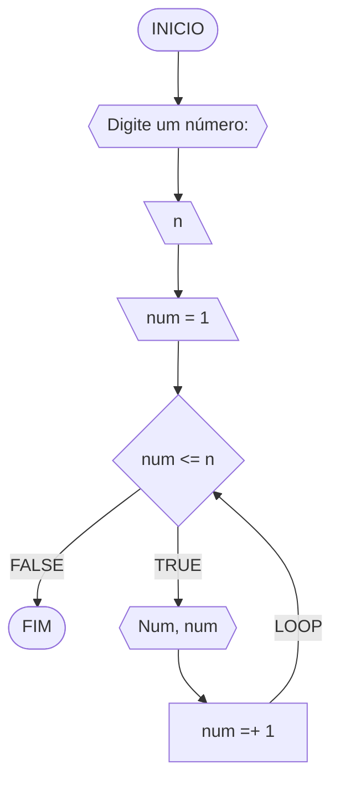
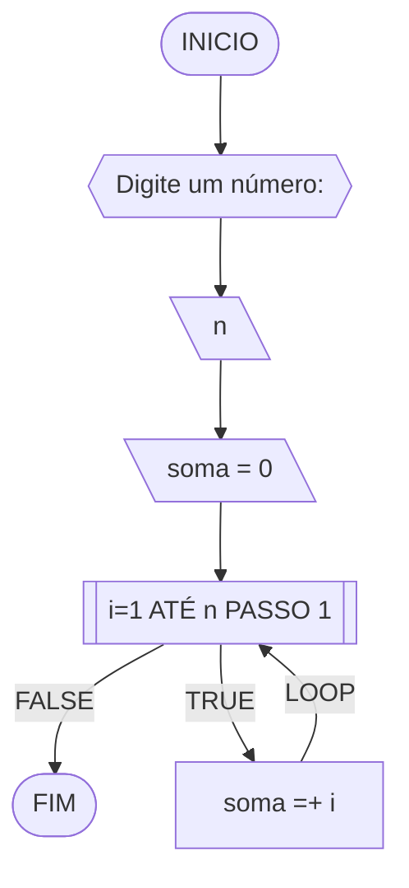
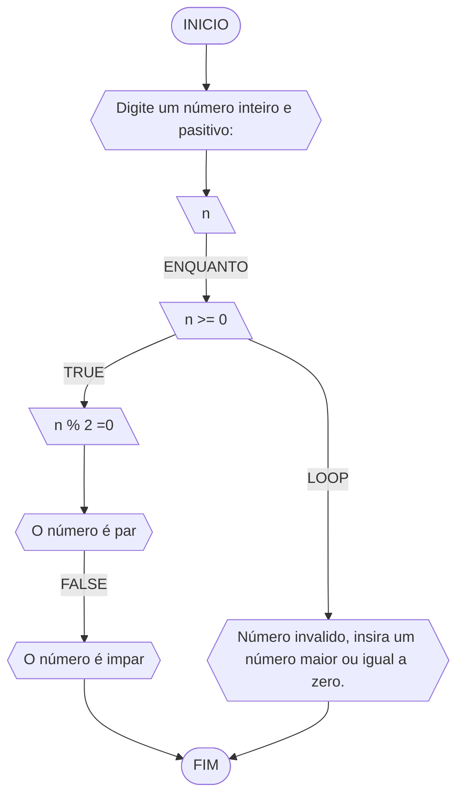
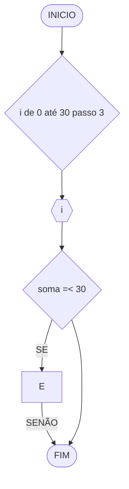
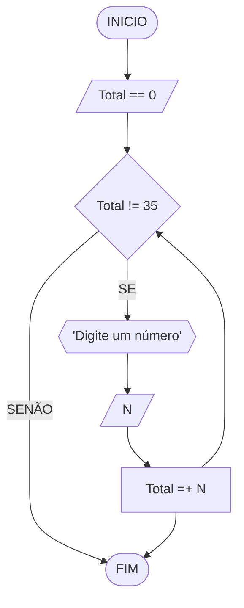
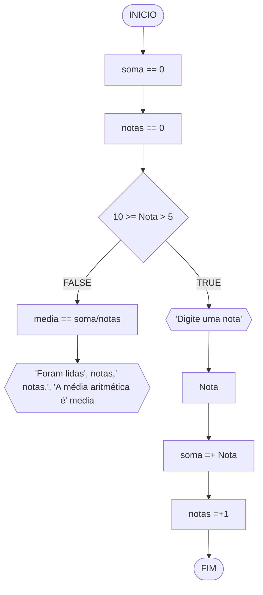

# UNIFOR
**Nome**: Sandra M Diógenes <br>
**Disciplina**: Raciocínio lógico algorítm

## Exercício exemplo 1
Implemente e teste um programa que imprima os n primeiros números.

#### Fluxograma


#### Pseudocódigo
```
1 ALGORITMO print_n_primeiros
2 DECLARE n, num: INTEIRO
3 INICIO
4 ESCREVA “Digite um número: ”
4 LEIA n			// variável de entrada n
4 num ← 1			// variável num inicializada
5 ENQUANTO num <= n FAÇA	// n iterações
7	ESCREVA “Número ”, num
8	num ← num + 1		// num =+ 1 (incremento)
8 FIM_ENQUANTO
9 FIM
```

#### Teste de mesa
| it | n  | num | num <= n | Saída      | num =+ 1 |
| -- | -- | --  | --       | --         | --       |
| 1  | 10 | 1   | True     | Número 1   | 2        |
| 2  | 10 | 2   | True     | Número 2   | 3        |
| 3  | 10 | 3   | True     | Número 3   | 4        |
| 4  | 10 | 4   | True     | Número 4   | 5        |
| 5  | 10 | 5   | True     | Número 5   | 6        |
| 6  | 10 | 6   | True     | Número 6   | 7        |
| 7  | 10 | 7   | True     | Número 7   | 8        |
| 8  | 10 | 8   | True     | Número 8   | 9        |
| 9  | 10 | 9   | True     | Número 9   | 10       |
| 10 | 10 | 11  | True     | Número 10  | 11       |
| 11 | 10 | 11  | False    |            |          |

## Exercício exemplo 2
Implemente e teste um programa que some os n primeiros números.

#### Fluxograma


#### Pseudocódigo
```
1  ALGORITMO	soma_n_numeros()
2  DECLARE	n, i, soma: INTEIRO
3  INICIO
4  ESCREVA “Digite a quantidade de números: ”
5  LEIA n		// variável de entrada n
7  soma ← 0		// variável soma inicializada
6  PARA i DE 1 ATÉ n PASSO 1 FAÇA
7	soma ← soma + i	// soma =+ i (incremento)
8  FIM_PARA
9  ESCREVA “A soma é igual a ”, soma
10 FIM
```

#### Teste de mesa
| it | n  | soma | i  | soma =+ i |
| -- | -- | --   | -- | --        |
| 1  | 10 | 0    | 1  | 1         |
| 2  | 10 | 1    | 2  | 3         |
| 3  | 10 | 3    | 3  | 6         |
| 4  | 10 | 6    | 4  | 10        |
| 5  | 10 | 10   | 5  | 15        |
| 6  | 10 | 15   | 6  | 21        |
| 7  | 10 | 21   | 7  | 28        |
| 8  | 10 | 28   | 8  | 36        |
| 9  | 10 | 36   | 9  | 45        |
| 10 | 10 | 45   | 10 | 55        | 

## Lista de exercícios 03

### Exercício 01 (2.5 pontos)
Atualize o algoritmo para determinar se um número inteiro e positivo é par ou ímpar, usando uma laço condicional para aceitar apenas números maiores ou iguais a zero. 

#### Fluxograma (1.0 ponto)



#### Pseudocódigo (1.0 ponto)

```
Algoritmo ClassificaCategoria
DECLARE n, INTEIRO
ESCREVA "Digite um número: " 
    LEIA n
    SE n >= 0 ENTÃO
        SE n % 2 == 0 ENTÃO
            ESCREVA "O número é par."
        SENÃO
            ESCREVA "O número é ímpar."
        FIM SE
    SENÃO
        ESCREVA "Por favor, insira um número maior ou igual a zero."
    FIM SE
FIM_ALGORITMO
```

#### Teste de mesa (0.5 ponto)
| Número | Validez | Resto | Resto == 0 |        Resultado         | 
|  --    |   --    |   --  |    --      |            --            | 
|  -2    |  TRUE   |   -   |     -      | Número deve ser positivo |
|   0    |  TRUE   |   0   |   TRUE     |       Número Par         |
|   2    |  TRUE   |   0   |   TRUE     |       Número Par         |
|   5    |  TRUE   |   1   |   FALSE    |      Número Impar        |


### Exercício 02 (2.5 pontos)
Faça um algoritmo que exiba na tela uma contagem de 0 até 30, exibindo apenas os múltiplos de 3.

#### Fluxograma (1.0 ponto)



#### Pseudocódigo (1.0 ponto)

```
Algoritmo ClassificaCategoria
DECLARE i, n, INTEIRO
INÍCIO
    PARA i ← 0 ATÉ 30 PASSO 1 FAÇA
        SE (i % 3 == 0) ENTÃO
            ESCREVA i
        FIM SE
    FIM PARA
FIM_ALGORITMO
```

#### Teste de mesa (0.5 ponto)
|  i | Passo 3 | i =< 30 |
| -- |   --    |    --   | 
|  0 |    3    |   TRUE  | 
|  6 |    9    |   TRUE  |
| 15 |    18   |   TRUE  |
| 30 |    33   |   FALSE |


### Exercício 03 (2.5 pontos)
Dada uma sequência de números inteiros, calcular a sua soma. 
Por exemplo, para a sequência {12, 17, 4, -6, 8, 0}, o seu programa deve escrever o número 35.

#### Fluxograma (1.0 ponto)



#### Pseudocódigo (1.0 ponto)

```
Algoritmo ClassificaCategoria
DECLARE N, Total: inteiro
INICIO
Total <- 0
ENQUANTO Total != 35 FAÇA
    ESCREVA "Digite um número"
    LEIA N
    Total <-- Total + N
FIM_ENQUANTO
FIM_ALGORITMO
```

#### Teste de mesa (0.5 ponto)
| Total |  N | Total + N | Total != 35|
|   --  | -- |     --    |     --     |
|    0  |  5 |      5    |    TRUE    |
|   32  |  3 |     35    |   FALSE    |
|   17  | 27 |     44    |    TRUE    |
|   37  | -2 |     35    |   FALSE    |


### Exercício 04 (2.5 pontos)
Escreva um programa que leia a nota de diversos alunos, até que seja digitada uma nota negativa. 
Nesse momento, ele mostra a média aritmética de todas as notas lidas e quantas notas foram lidas. 
Ex. Foram lidas 14 notas. A média aritmética é 6.75!

#### Fluxograma (1.0 ponto)



#### Pseudocódigo (1.0 ponto)

```
Algoritmo ClassificaCategoria
DECLARE Nota, soma, notas, media
INICIO
soma <- 0
notas <- 0
media <- soma/notas
ENQUANTO 10 >= Nota > 5 FAÇA
    ESCREVA "Digite uma nota"
    LEIA Nota
    soma = + Nota
    notas = + 1
FIM_ENQUANTO
    ESCREVA "Foram lidas ", notas, " notas", "A média aritmética é ", media
FIM_ALGORITMO
```

#### Teste de mesa (0.5 ponto)
| Nota | 10 >= Nota > 5 | soma | soma =+Nota | notas | notas =+1| media == soma/notas |  
|  --  |       --       |  --  |      --     |   --  |    --    |          --         |
|   6  |      TRUE      |   6  |      12     |    1  |     2    |           6         |
|   8  |      TRUE      |  32  |      40     |    5  |     6    |           6.66      |
|   9  |      TRUE      |   0  |       9     |    0  |     1    |           9         |
|   3  |      FALSE     |  102 |     --      |   14  |    --    |           7.28      |

