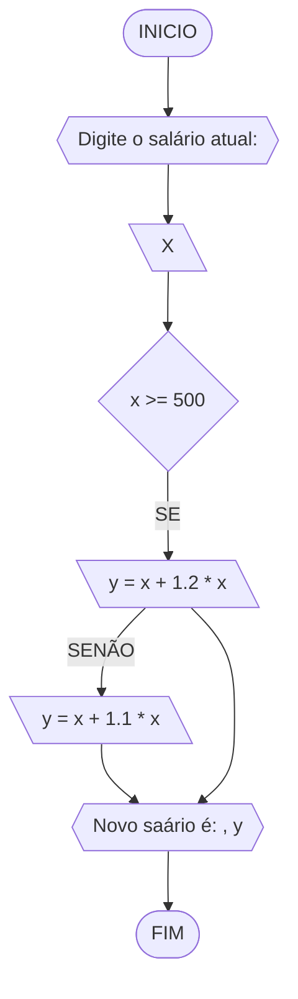
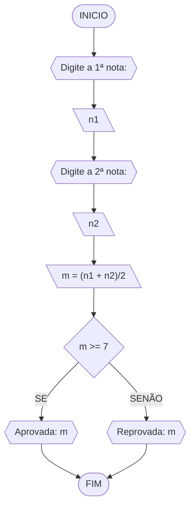
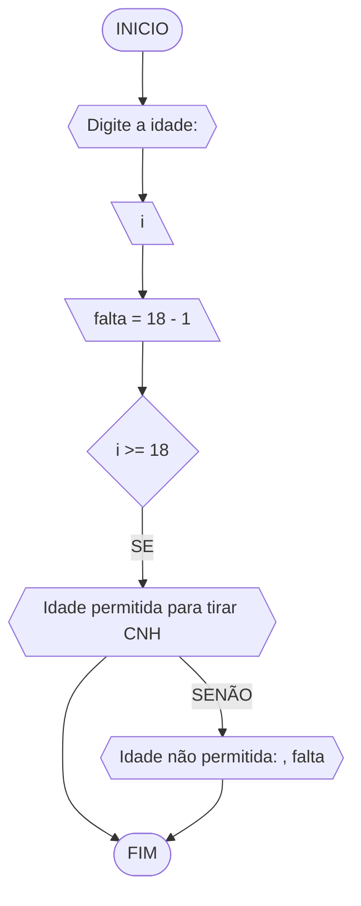

# UNIFOR
**Nome**: Nome do estudante <br>
**Disciplina**: Raciocínio lógico algorítmico

## Lista de exercícios 01

### Exercício 01 (1 ponto)
Represente, em fluxograma e pseudocódigo, um algoritmo para determinar se um número inteiro e positivo é par ou impar.

#### Fluxograma (0,25 ponto)


#### Pseudocódigo (0,5 ponto)
```
1  ALGORTIMO verifica_par_impar
2  DECLARE numero, resto: INTEIRO
3  ESCREVA "Digite um número: "
4  INICIO
4  LEIA numero
5  SE numero >= 0 ENTAO                  // verifica se o inteiro é positivo
6    resto = numero % 2                 // calcula o resto da divisão por 2
7    SE resto == 0 ENTAO                // verifica se o resto é igual a zero
8      ESCREVA "O número é par!"
9    SENAO
10     ESCREVA "O número é impar!"
11   FIM_SE
11  SENAO                                // caso inteiro for negativo (condição linha 5)
12    ESCREVA "O número deve ser postivo!"
13  FIM_SE
13 FIM
```

#### Teste de mesa (0,25 ponto)
| numero | numero >= 0 | resto | resto == 0 |           Saída              |
|   --   |    --       |   --  |      --    |             --               | 
|   -1   |     F       |   -   |     -      | "O número deve ser postivo!" |
|    0   |     V       |   0   |     V      |      "O número é par!"       |
|   13   |     V       |   1   |     F      |     "O número é impar!"      |
|   30   |     V       |   0   |     V      |      "O número é par!"       |

## Exercício 02 (3 pontos)
Represente, em fluxograma e pseudocódigo, um algoritmo para calcular o novo salário de um funcionário. 
Sabe-se que os funcionários que recebem atualmente salário de até R$ 500 terão aumento de 20%; os demais terão aumento de 10%.

#### Fluxograma (1.0 ponto)



#### Pseudocódigo (1.0 ponto)

```
Algoritmo Novo_Salario
DECLARE x, y, NÚMERO
ESCREVA "Digite o saláio atual: "
LEIA x
SE x >= 500
  ENTÃO y = x + 1.2 * x
SENÃO
y = x + 1.1 * x
ESCREVA "Novo Salário é: " y
FIM_ALGORITIMO

```

#### Teste de mesa (1.0 ponto)

|     x    | x >= 500 | aumento 20%| aumento 10%  | Novo salário | 
|    --    |   --     |      --    |      --      |      --      | 
|   450    |   FALSE  |     -      |      495     |     495      |
|   900    |   TRUE   |    1080    |       -      |    1080      |
|  2000    |   TRUE   |    2400    |       -      |    2400      |
## Exercício 03 (3 pontos)
Represente, em fluxograma e pseudocódigo, um algoritmo para calcular a média aritmética entre duas notas de um aluno e mostrar sua situação, que pode ser aprovado ou reprovado.

#### Fluxograma (1 ponto)



#### Pseudocódigo (1 ponto)

```
ALGORITIMO Media_Aritimética
DECLARE n1, n2, m: NÚMERO
ESCREVA "Digite a 1ª nota: "
LEIA n1
ESCREVA "Digite a 2ª nota: "
LEIA n2
m = (n1 + n2)/2
SE m >= 7 
  ENTÃO ESCREVA "Aprovado" , m
SENÃO
  ESCREVA "Reprovado" , m
FIM_ALGORITIMO

```

#### Teste de mesa (1 ponto)

|  n1  |  n2  | m = (n1 + n2)/2 | m >= 7 |  resutado  | 
|  --  |  --  |        --       |  --    |     --     | 
| 8,0  |  4,0 |      6,0        | FALSE  | Reprovado  |
| 5,0  |  9,0 |      7,0        | TRUE   | Aprovado   |
| 9,0  |  8,0 |      8,5        | TRUE   | Aprovado   |
## Exercício 04 (3 pontos)
Represente, em fluxograma e pseudocódigo, um algoritmo que, a partir da idade do candidato(a), determinar se pode ou não tirar a CNH. 
Caso não atender a restrição de idade, calcular quantos anos faltam para o candidato estar apto.

#### Fluxograma (1.0 ponto)



#### Pseudocódigo (1.0 ponto)

```
Algoritmo Idade_CNH
DECLERE i, falta NÚMERO
ESCREVA "Digite a idade: "
LEIA i
falta = 18 - i
SE i >= 18
  ENTÃO ESCREVA "Idade permitida"
SENÃO
ESCREVA "Idade não permitida, falta: ", falta
FIM_ALGORITMO
```
#### Teste de mesa (1 ponto)

| idade | idade >= 18 | falta = 18 - idade |   resutado    | 
|  --   |     --      |        --          |       --      | 
|   17  |  false      | falta = 18 - 17    |  falta 1 ano  |
|   18  |   true      |         -          |idade permitida|
|   12  |   false     | falta = 18 - 12    |  falta 6 anos |
