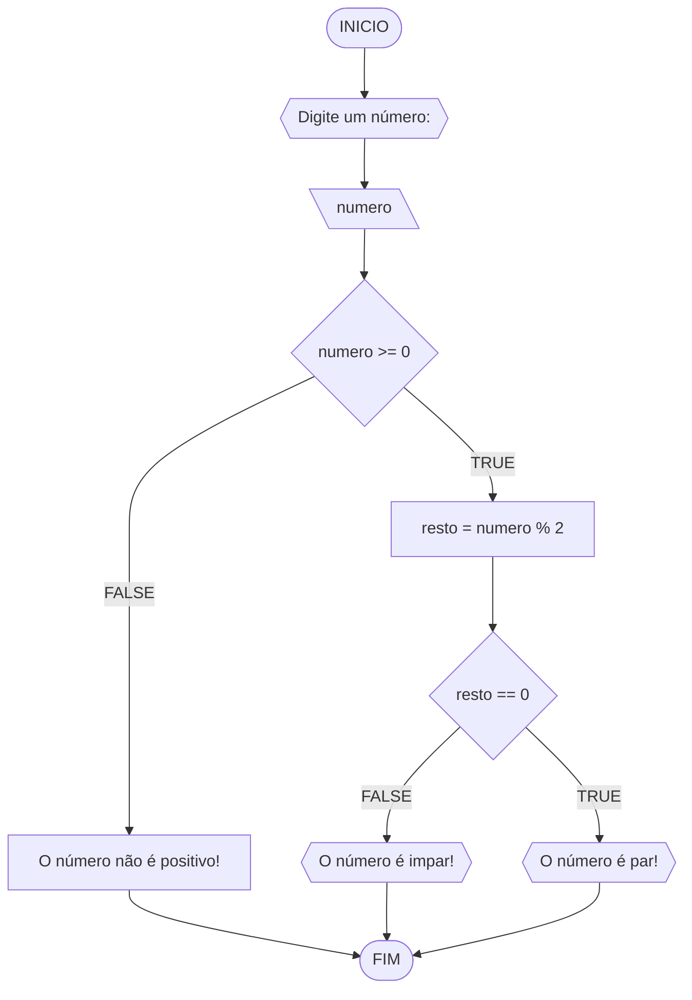
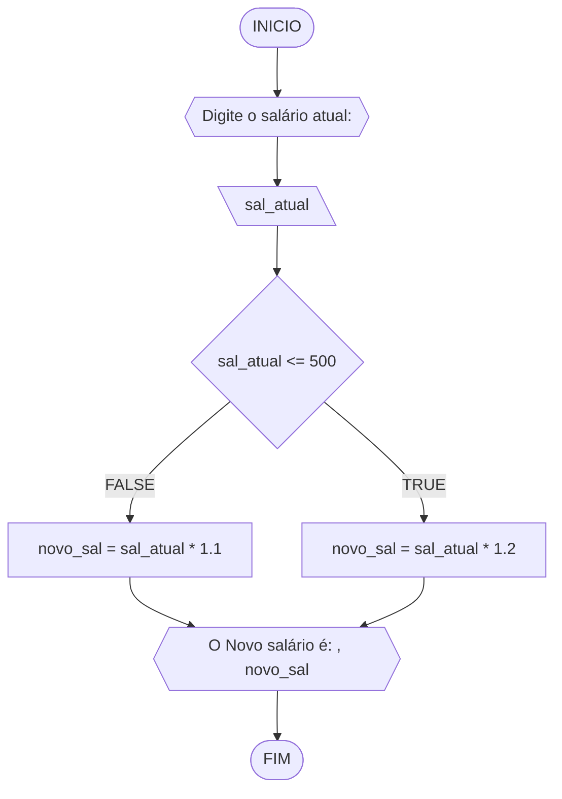
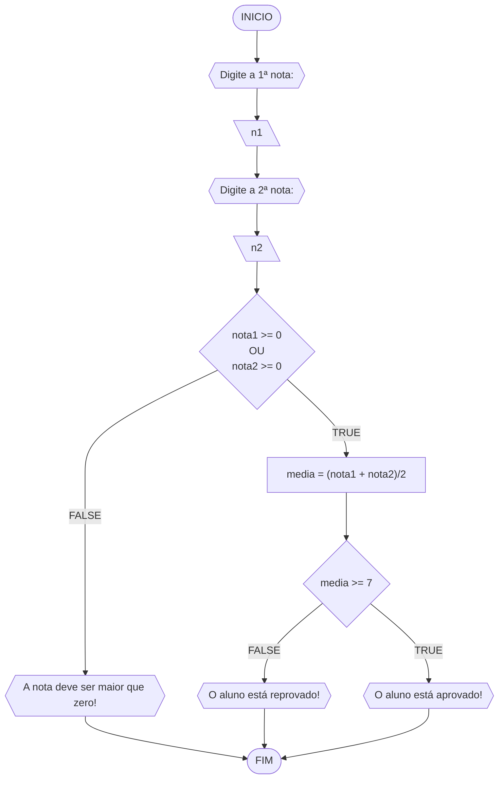
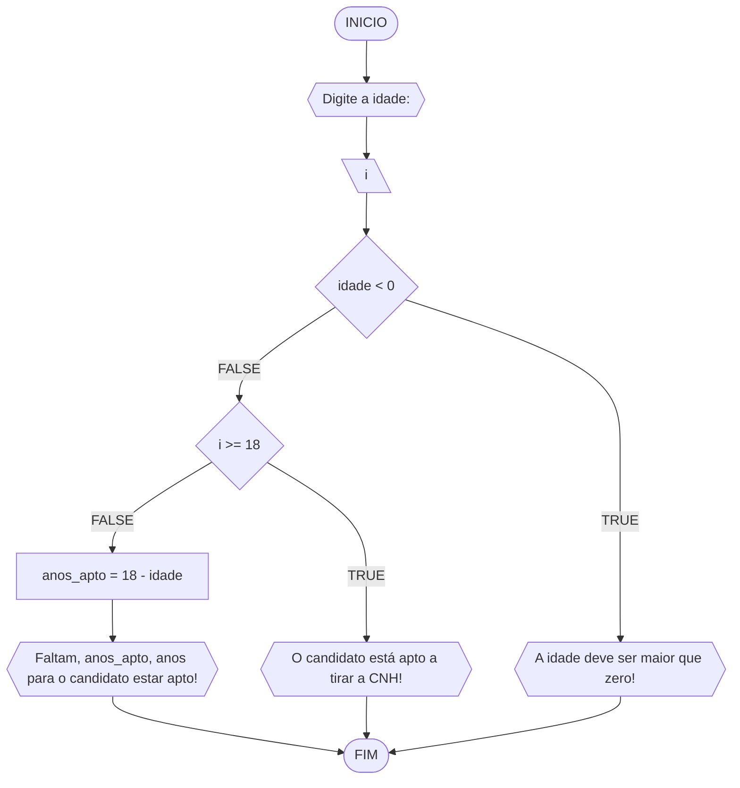

# UNIFOR
**Nome**: Sandra M Diogenes <br>
**Disciplina**: Raciocínio lógico algorítmico

## Lista de exercícios 01

### Exercício 01 (1 ponto)
Represente, em fluxograma e pseudocódigo, um algoritmo para determinar se um número inteiro e positivo é par ou impar.

#### Fluxograma (0,25 ponto)



#### Pseudocódigo (0,5 ponto)
```
1  ALGORTIMO verifica_par_impar
2  DECLARE numero, resto: INTEIRO
3  INICIO
4    ESCREVA "Digite um número: "
5    LEIA numero
6    SE numero >= 0 ENTAO                  // verifica se o inteiro é positivo
7      resto <- numero % 2                 // calcula o resto da divisão por 2
8      SE resto == 0 ENTAO                // verifica se o resto é igual a zero
9        ESCREVA "O número é par!"
10     SENAO
11       ESCREVA "O número é impar!"
12     FIM_SE
13   SENAO                                // caso inteiro for negativo (condição linha 5)
14     ESCREVA "O número deve ser postivo!"
15   FIM_SE
16 FIM
```

#### Teste de mesa (0,25 ponto)
| numero | numero >= 0 | resto | resto == 0 |           Saída              |
|   --   |    --       |   --  |      --    |             --               | 
|   -2   |     F       |   -   |     -      | "O número deve ser postivo!" |
|    0   |     V       |   0   |     V      |      "O número é par!"       |
|   15   |     V       |   1   |     F      |     "O número é impar!"      |
|   44   |     V       |   0   |     V      |      "O número é par!"       |

## Exercício 02 (3 pontos)
Represente, em fluxograma e pseudocódigo, um algoritmo para calcular o novo salário de um funcionário. 
Sabe-se que os funcionários que recebem atualmente salário de até R$ 500 terão aumento de 20%; os demais terão aumento de 10%.

#### Fluxograma (1.0 ponto)



#### Pseudocódigo (1.0 ponto)

```
Algoritmo Novo_Salario
DECLARE x, y, NÚMERO
INICIO
  // Obter o valor do salario atual
  ESCREVA "Digite o salário atual: "
  // Guardar o salario atual
  LEIA sal_atual
  // insirir primeira informação condicional
  SE sal_atual <= 500 ENTAO
    novo_sal = sal_atual * 1.2
  // insirir segundfa informação condicional
  SENÃO
    novo_sal = sal_atual * 1.1
  FIM_SE
  // imprima resultado 
  ESCREVA "Novo Salário é: ", novo_sal
FIM

```

#### Teste de mesa (1.0 ponto)
| sal_atual | sal_atual >= 500 |novo_sal       | saída                   | 
| --        | --               | --            | --                      | 
| 300       | False            | 300*1.2 = 360 | O novo salário é R$ 360 |
| 700       | True             | 700*1.1 = 770 | O novo salário é R$ 770 |
| 500       | True             | 500*1.2 = 600 | O novo salário é R$ 600 |

## Exercício 03 (3 pontos)
Represente, em fluxograma e pseudocódigo, um algoritmo para calcular a média aritmética entre duas notas de um aluno e mostrar sua situação, que pode ser aprovado ou reprovado.

#### Fluxograma (1 ponto)



#### Pseudocódigo (1 ponto)

```
ALGORITIMO Media_Aritimética
DECLARE n1, n2, m: NÚMERO
INICIO
  // Obter a primeira nota
  ESCREVA "Digite a 1ª nota: "
  // Guardar esta primeira nota
  LEIA n1
  // Obter a segunda nota
  ESCREVA "Digite a 2ª nota: "
  // Guardar esta segunda nota
  LEIA n2
  // inserir a primeira estrutura condicional
  SE n1 >= 0 E n2 >= 0 ENTÃO
    // inserir a operação matematica
    m = (n1 + n2)/2
    // inserir a segunda estrutura condicional
    SE m >= 7 ENTÃO
      // imprimir resultado
      ESCREVA "Aprovado" , m
    FIM_SE
    // se não satisfazer (n1 >= 0 E n2 >= 0)
    SENÃO
      // imprima a nota deve ser maior que zero
      ESCREVA "A NOTA DEVE SER MAIOR QUE ZERO!"
    FIM_SENÃO
FIM

```

#### Teste de mesa (1 ponto)
| nota1 | nota2 | nota1 >= 0 E nota2 >= 0 | media        |            saĩda               | 
| --    | --    | --                      | --           |              --                | 
| -2    | 0     | False                   |              | A nota deve ser maior que zero!| 
| 0     | 0     | True                    | (0+0)/2 = 0  | O aluno está reprovado!        |
| 5     | 7     | True                    | (5+7)/2 = 6  | O aluno está reprovado!        |
| 6     |  9    | True                    | (6+9)/2 = 7,5| O aluno está aprovado!         |

## Exercício 04 (3 pontos)
Represente, em fluxograma e pseudocódigo, um algoritmo que, a partir da idade do candidato(a), determinar se pode ou não tirar a CNH. 
Caso não atender a restrição de idade, calcular quantos anos faltam para o candidato estar apto.

#### Fluxograma (1.0 ponto)



#### Pseudocódigo (1.0 ponto)

```
Algoritmo Idade_Apta_CNH
DECLERE i, anoas_ apto: INTEIRO

INICIO
  // Obter informação inicial
  ESCREVA "Digite a idade: "
  // Guarda esta informação
  LEIA i
  // inserir informações condicional
  SE i < 0 ENTÃO
  ESCREVA "Idade deve ser maior que zero!"
  // inserir informações condicional
  SENÃO
    // inserir informações condicional
    SE idade >= 18 ENTAO
      ESCREVA "O candidato está apto a tirar a CNH!"
    // inserir operação matematica
    SENÃO
      anos_apto <- 18 - idade
      // imprimir resultado
      ESCREVA "Faltam", anos_apto, "ano(s) para o candidato estar apto
    FIM_SE
  FIM_SE
FIM
```
#### Teste de mesa (1 ponto)

| idade | idade < 0 | idade >= 18 | anos_apto | saída                                        | 
| --    | --        | --          | --        | --                                           | 
| -1    | True      |             |           |                                              |
| 1     | False     | False       | 18-1 = 17 | Faltam 17 ano(s) para o candidato estar apto!|
| 16    | False     | False       | 18-16 = 2 | Faltam 2 ano(s) para o candidato estar apto! |
| 18    | False     | True        |           | O candidato está apto a tirar a CNH!         |

